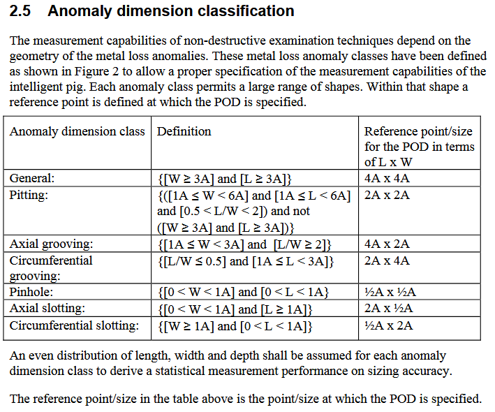
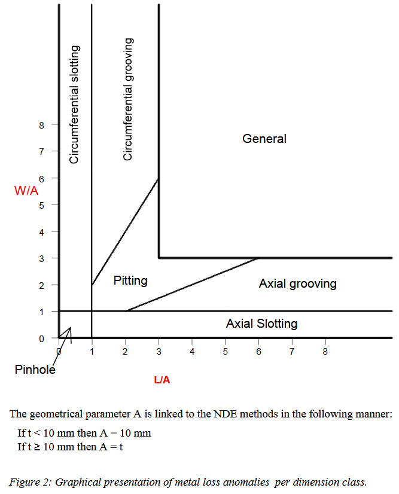

# Python class for pipeline anomaly dimension classification

This Python module implements the definition of the "defect dimension class" of a pipeline according to [Specifications and requirements for intelligent pig inspection of pipelines](https://www.researchgate.net/figure/a-Graphical-presentation-of-surface-dimensions-of-metal-loss-anomalies-per-dimension_fig1_370191037).





## Installation pipeline_anomaly_dimension_class

```bash
pip install pipeline-anomaly-dimension-class
```

## Usage

```python
from pipeline_anomaly_dimension_class import size_class, FeatureClass

# a defect measuring 100x100 mm on a pipe wall 10 mm thick is a defect of the “GENE” class
assert size_class(100, 100, 10) == FeatureClass.GENE

# defects with zero dimensions are not allowed
size_class(0, 100, 10)
oeg_feature_class.Error: Wrong FeatureClass params. l=0 w=100 t=10

```

## Development

```bash
git clone git@github.com:vb64/pipeline.anomaly.dimension.class.git
cd oeg.feature.class
```

With Python 2
```bash
make setup2 PYTHON_BIN=/path/to/python27/executable
```

With Python 3
```bash
make setup PYTHON_BIN=/path/to/python3/executable
```

Then
```bash
make tests
```
